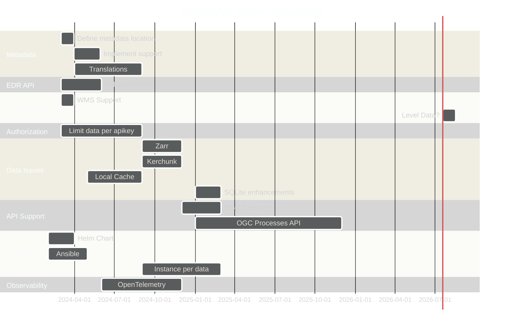

```mermaid
%%{init: {'theme': 'dark' } }%%

gantt
    title SmartMet Server Roadmap
    dateFormat YYYY-MM
    section Metadata
        Define metadata location :a1, 2024-03, 30d
        Implement support :after a1, 60d
        Translations :2024-04, 2024-09
    section EDR API
        Enhancements :2024-03, 2024-06
    section LUA Support
        WMS Support :2024-03, 30d
        Level Data?  :after WMS Support, 30d

        click cl1 href "https://mermaidjs. github.io/"
    section Authorization
        Limit data per apikey :2024-03, 2024-09
    section Data Issues
        Zarr :2024-09, 2024-12
        Kerchunk :2024-09, 2024-12
        Local Cache :2024-05, 2024-09
        SQLite enhancements :2025-01, 2025-03
    section API Support
        OGC Tiles API :2024-12, 2025-03
        OGC Processes API :2025-01, 2025-12
    section Deployment
        Helm Chart :2024-02, 2024-04
        Ansible :2024-02, 2024-05
        Instance per data :2024-09, 2025-03
    section Observability
        OpenTelemetry :2024-06, 2024-12

```
