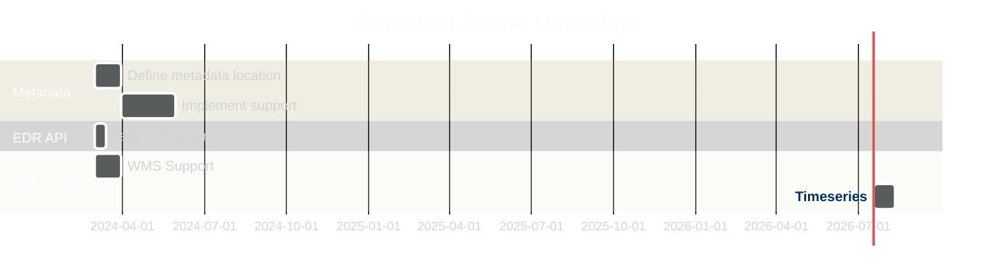

```mermaid
%%{init: {'theme': 'dark' } }%%

gantt
    title SmartMet Server Roadmap
    dateFormat YYYY-MM
    section Metadata
        Define metadata location          :a1, 2024-03-01, 30d
        Implement support     :after a1, 60d
    section EDR API
        Task in Another :2024-03-01, 12d
    section LUA Support
        WMS Support :2024-03-01, 30d
        Timeseries  :cl1, after WMS Support, 24d

        click cl1 href "https://mermaidjs. github.io/"

```
