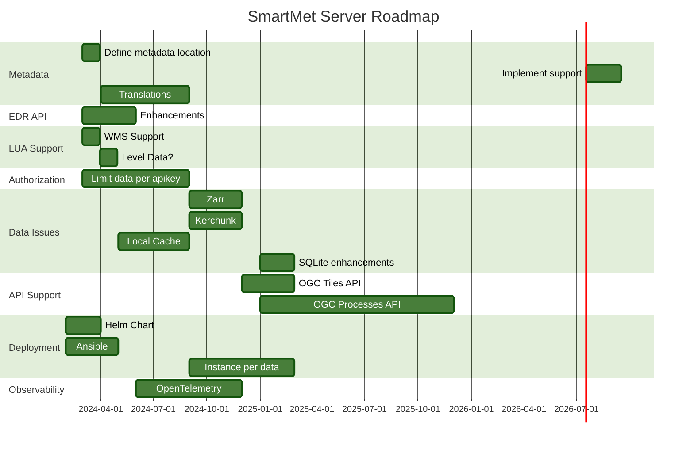

```mermaid
%%{init: {'theme': 'forest' } }%%

gantt
    title SmartMet Server Roadmap
    dateFormat YYYY-MM
    section Metadata
        Define metadata location :define-metadata, 2024-03, 30d
        Implement support :implement-metadata, after define, 60d
        Translations :translations, 2024-04, 2024-09
    section EDR API
        Enhancements :edr-enhancements, 2024-03, 2024-06
    section LUA Support
        WMS Support :lua-wms, 2024-03, 30d
        Level Data?  :after lua-wms, 30d
    section Authorization
        Limit data per apikey :auth-limit, 2024-03, 2024-09
    section Data Issues
        Zarr :zarr, 2024-09, 2024-12
        Kerchunk :kerchunk, 2024-09, 2024-12
        Local Cache :local-cache, 2024-05, 2024-09
        SQLite enhancements :sqlite, 2025-01, 2025-03
    section API Support
        OGC Tiles API :ogc-tiles-api, 2024-12, 2025-03
        OGC Processes API :ogc-processes-api, 2025-01, 2025-12
    section Deployment
        Helm Chart :helm-chart, 2024-02, 2024-04
        Ansible :ansible, 2024-02, 2024-05
        Instance per data :instance-per-data, 2024-09, 2025-03
    section Observability
        OpenTelemetry :opentelemetry, 2024-06, 2024-12

```
